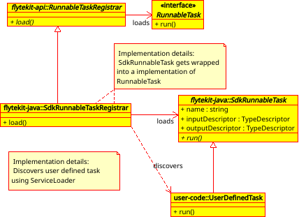
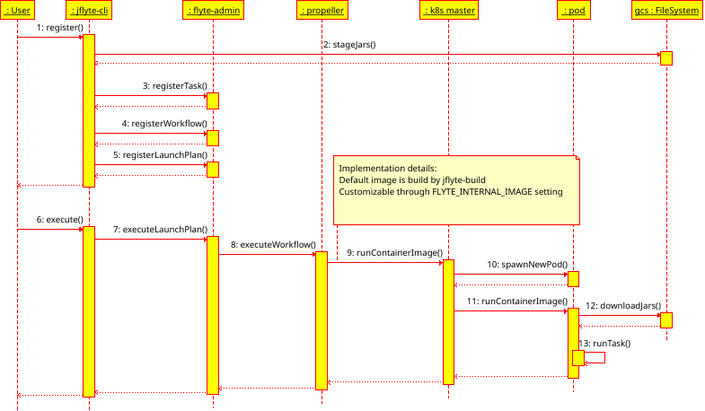

# Architecture of Flyte Java SDK

`flytekit-java` consists of multiple modules: 

* `flytekit-api` is a common interface between `jflyte` and `flytekit-java`.
All changes to `flytekit-api` MUST be binary compatible, allowing to upgrade `jflyte` and `flytekit-java` 
independently. It’s a layer of auto-value objects for `flyteidl`, and interfaces for discovery of tasks and workflows.
* `flytekit-java` is Java SDK for Flyte, allowing definition of tasks and workflows.
* `jflyte` is a command line tool to register tasks and workflows in flyteadmin, and it also implements container 
runtime (see more in [Container Runtime](#container-runtime)).
* `jflyte-api` is a common interface for `jflyte` plugins.
* `jflyte-google-cloud` Google Cloud Platform plugin for `jflyte`, adding support for GCS file system.
* `jflyte-build` is a docker image running Java code, contains `jflyte` and `jflyte-google-cloud` plugin. Users can 
build their own docker image, and use it by overriding the `FLYTE_INTERNAL_IMAGE` setting.

## Workflow and Task Discovery and Registration

Workflows and tasks are discovered using [`ServiceLoader`][service_loader]. For that, `flytekit-java` provides 
instances of `RunnableTaskRegistrar` and `WorkflowRegistrar`. Using these two interfaces, flytekit-java will discover 
and register tasks and workflows. While the existing version of `flytekit-java` happens to use ServiceLoader to 
register instances of SdkRunnableTask and SdkWorkflow, this logic is encapsulated in concrete implementation of 
registrar, and can be different, for instance, in `flytekit-scala`.


## Container Runtime

When `jflyte` registers workflows and tasks, for `RunnableTask` it stages classpath to `FileSystem`, for instance, 
GCS or S3. It includes hashes into resource names to avoid collisions. After that, it creates an index file with a 
list of URI-s and checksums for each individual resource. When flytepropeller creates Kubernetes pod with docker args:

```bash
jflyte 
  execute 
  --task <task_name> 
  --inputs gs://.../inputs.pb 
  --outputPrefix gs://.../data 
  --indexFileLocation gs://.../classpath-XXX
```
  
`jflyte` code within container downloads classpath from staging location, verifies checksums and executes the code. 
By default, `jflyte` uses docker image build as a part of `jflyte-build`, that is customizable through 
`FLYTE_INTERNAL_IMAGE` setting.



## Class Loader Isolation

In the past, we have struggled with dependency conflicts on classpath. There are multiple causes for it:
Users of `flytekit-java` can add their own dependencies to classpath, that can cause dependency conflicts with 
`flytekit-java`, `jflyte`, and their dependencies. 

There could be dependency conflicts between different `jflyte` plugins as well, for instance, between GCP and AWS 
ones using different versions of Netty or gRPC.

We avoid dependency conflicts by following the set of rules:
- All changes to `flytekit-api` MUST be binary compatible, allowing to upgrade `jflyte` and `flytekit-java` 
independently.
- We SHOULD avoid adding dependencies to `flytekit-api`, `jflyte-api` and `flytekit-java`.
- We MUST shade any dependency in `flytekit-api` and `flytekit-java`.
- We MUST NOT expose any dependency on the API surface in `jflyte-api`, `flytekit-api` and `flytekit-java`.
- We SHOULD NOT expose `flytekit-api` in the API surface in `flytekit-java`.
- We SHOULD avoid dependencies in `flytekit-scala`

We use `ChildFirstClassLoader`, that loads classes into child class loader instead of parent.

The parent class loader loads `jflyte`, it's dependencies, and `flytekit-api`. Each `jflyte` plugin and user 
classpath are loaded in it's own child-first class loader, and therefore they don't interfere.

Users can decide which version of `flytekit-java` to use. `flytekit-java` doesn’t contain unshaded dependencies, 
therefore, it can't cause dependency conflicts in user class path. We don't want to expose `flytekit-api` to
users, because it isn't intended for this purpose, instead, it's optimized to be minimal and binary compatible.
Instead, `flytekit-java` provides higher-level abstractions.

## References
* [lyft/flyteidl](https://github.com/lyft/flyteidl) – all Flyte IDL’s
* [lyft/flyteadmin](https://github.com/lyft/flyteadmin) – control plane for Flyte
* [lyft/flytepropeller](https://github.com/lyft/flytepropeller) – Kubernetes-native execution engine for Flyte
* [lyft/flytekit](https://github.com/lyft/flytekit) – Python SDK for Flyte

[service_loader]: https://docs.oracle.com/javase/9/docs/api/java/util/ServiceLoader.html
